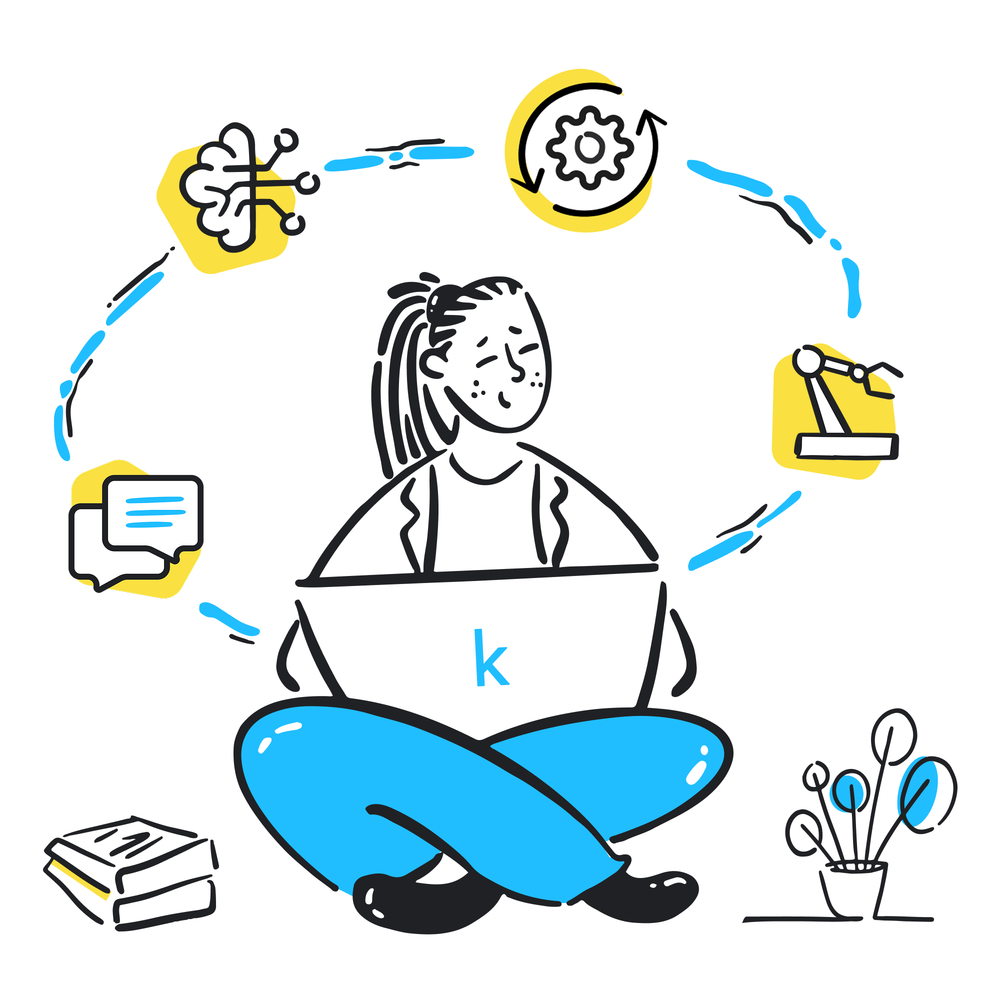

# Kaggle 5-Day AI Agents Intensive Course

A collaborative program by **Google** and **Kaggle** designed to equip participants with the knowledge and skills to build and deploy intelligent AI agents using Google's Agent Development Kit (ADK).





> **Course Link**: [Kaggle 5-Day Agents Course](https://www.kaggle.com/learn-guide/5-day-agents)

---

## 📑 Table of Contents

- [Course Overview](#-course-overview)
- [Course Structure](#-course-structure)
- [Progress Tracker](#-progress-tracker)
  - [✅ Day 1: Introduction to Agents & Agentic Architectures](#-day-1-introduction-to-agents--agentic-architectures-completed)
  - [✅ Day 2: Agent Tools & Interoperability with MCP](#-day-2-agent-tools--interoperability-with-mcp-completed)
  - [⬜ Day 3: Context Engineering & Memory Management](#-day-3-context-engineering--memory-management-pending)
  - [⬜ Day 4: Agent Quality: Observability, Logging, Tracing & Evaluation](#-day-4-agent-quality-observability-logging-tracing--evaluation-pending)
  - [⬜ Day 5: Prototype to Production](#-day-5-prototype-to-production-pending)
- [Resources](#-resources)
- [Acknowledgment & Disclaimer](#-acknowledgment--disclaimer)

---

## 📚 Course Overview

This intensive 5-day course combines **theoretical insights** with **practical applications**, guiding learners from foundational concepts to production-ready AI agent systems. Each day includes:

- 📖 **Whitepapers**: Deep conceptual understanding
- 🎧 **Podcasts**: Summary discussions via NotebookLM
- 💻 **Codelabs**: Hands-on coding exercises on Kaggle
- 🎥 **Live Discussions**: Community engagement and Q&A

**Key Technologies:**
- Google's Agent Development Kit (ADK)
- Gemini Models (Flash & Pro)
- Model Context Protocol (MCP)
- OpenTelemetry for observability

---

## 🗓️ Course Structure

| Day | Topic | Status |
|-----|-------|--------|
| **Day 1** | Introduction to Agents & Agentic Architectures | ✅ Completed |
| **Day 2** | Agent Tools & Interoperability with MCP | ✅ Completed |
| **Day 3** | Context Engineering & Memory Management | ⬜ Pending |
| **Day 4** | Agent Quality: Observability, Logging, Tracing & Evaluation | ⬜ Pending |
| **Day 5** | Prototype to Production | ⬜ Pending |

---

## 📊 Progress Tracker

### ✅ Day 1: Introduction to Agents & Agentic Architectures (Completed)

**📁 Folder**: [`day_01/`](./day_01/)

#### What I Learned

**Theoretical Foundations:**
- 🚀 The paradigm shift from Predictive AI to Autonomous Agents
- 🎯 The four essential components of an AI Agent (Brain, Hands, Nervous System, Body)
- 🔄 The 5-step "Think, Act, Observe" process
- 📊 Taxonomy of Agentic Systems (Levels 0-4: from Core Reasoning to Self-Evolving Systems)
- 🏗️ Core architecture deep dive: Model selection, Tools, Orchestration, and Deployment
- 🏭 Agent Ops for production readiness
- 🔒 Security & Governance strategies
- 🔮 Future of agents: Learning, evolution, and Agent Gym concept

**Practical Skills:**
- Built my first AI agent using Google's Agent Development Kit (ADK)
- Configured Gemini API authentication with Kaggle Secrets
- Implemented a simple agent with Google Search tool
- Created multi-agent systems with specialized agents
- Mastered four workflow patterns:
  - **LLM-based orchestration** - Dynamic decision-making
  - **Sequential agents** - Fixed execution pipeline
  - **Parallel agents** - Concurrent task execution
  - **Loop agents** - Iterative refinement cycles
- Used ADK's web interface for debugging and testing

#### Materials Completed

**📖 Whitepaper**: Introduction to Agents ✅
- Comprehensive notes extracted and documented
- Key concepts: Taxonomy, Architecture, Security, Agent Ops

**💻 Codelabs**: ✅
1. **day-1a-from-prompt-to-action.ipynb** - Built first AI agent with tool-calling capabilities
2. **day-1b-agent-architectures.ipynb** - Created multi-agent systems with workflow patterns

**📊 Resources Created**:
- Comprehensive README with digestible notes from whitepaper
- Organized theoretical foundations and practical exercises
- Complete Table of Contents for easy navigation

#### Key Takeaways

1. **Paradigm Shift**: Agents are active, autonomous problem-solving partners (not passive tools)
2. **It's a System**: A successful agent is an engineered system with Model, Tools, and Orchestration
3. **New Disciplines**: Building agents requires Agent Ops, Security Identity, and Multi-Agent architecture

---

### ✅ Day 2: Agent Tools & Interoperability with MCP (Completed)

**📁 Folder**: [`day_02/`](./day_02/)

#### What I Learned

**Theoretical Foundations:**
- 🔧 Why agents need tools to transform from advisors to executors
- 🌐 Model Context Protocol (MCP) - the "USB for AI agents"
- 🏗️ MCP Architecture: Client-Server model with Resources, Tools, and Prompts
- 🔌 Standardization benefits: One protocol for all integrations
- 💡 Community-driven ecosystem of MCP servers (GitHub, Slack, databases, image generation)
- ⚖️ Production-ready patterns for tool development
- ⏳ Long-running operations and human-in-the-loop workflows

**Practical Skills:**
- Built custom function tools following ADK best practices (type hints, docstrings, structured returns)
- Created a currency converter agent with multiple tools (fee lookup, exchange rates)
- Used agents as tools - built a calculation agent that generates and executes Python code
- Connected to external MCP servers (Everything MCP, Image Generation server)
- Implemented long-running operations with pause-resume patterns
- Built a shipping coordinator with approval workflows for large orders
- Mastered tool patterns:
  - **Function Tools** - Custom business logic
  - **Agent Tools** - Specialist agent delegation
  - **MCP Tools** - External service integration
  - **Long-Running Tools** - Human approval workflows
- Used `ToolContext` for confirmation requests
- Managed state with `ResumabilityConfig` and `App`

#### Materials Completed

**📖 Whitepaper**: Agent Tools & Interoperability with MCP ✅
- Comprehensive notes on MCP architecture and benefits
- Key concepts: Resources, Tools, Prompts, Client-Server model

**💻 Codelabs**: ✅
1. **day-2a-agent-tools.ipynb** - Custom function tools, agent tools, code execution
2. **day-2b-agent-tools-best-practices.ipynb** - MCP integration, long-running operations
3. **day-2b-final-exercise-solution.ipynb** - Complete image generation agent with cost approval

**🎨 Exercise Completed**: ✅
**Image Generation Agent with Cost Approval**
- Integrated MCP image generation server (Replicate API)
- Auto-approves single image requests (≤1 image)
- Pauses for human approval on bulk requests (>1 image)
- Implements resumable workflows with state management
- Demonstrates real-world compliance patterns for cost control

**📊 Resources Created**:
- Comprehensive README with whitepaper notes and practical guides
- Best practices guide (5 categories with DO/DON'T examples)
- Complete code examples for all tool types

#### Key Takeaways

1. **Tools Transform Agents**: Without tools, agents are isolated. With tools, they become executors that can interact with the real world
2. **MCP Solves Integration Chaos**: One standard protocol eliminates hundreds of hours of custom API client development
3. **Production Patterns Matter**: Structured returns, error handling, and approval workflows separate POCs from production systems
4. **Pausable Workflows**: Human-in-the-loop patterns using `ToolContext`, `invocation_id`, and state management enable compliance checkpoints

---

### ⬜ Day 3: Context Engineering & Memory Management (Pending)

**📁 Folder**: [`day_03/`](./day_03/)

#### Topics to Cover

- Context engineering principles
- Short-term vs. long-term memory
- Memory management strategies
- Retrieval-Augmented Generation (RAG)
- Session state management
- Context window optimization

#### Assignments

**📖 Whitepaper**: Context Engineering & Memory
**🎧 Podcast**: Unit 3 Summary
**💻 Codelabs**: TBD

---

### ⬜ Day 4: Agent Quality: Observability, Logging, Tracing & Evaluation (Pending)

**📁 Folder**: [`day_04/`](./day_04/)

#### Topics to Cover

- Observability in agent systems
- Logging best practices
- Distributed tracing with OpenTelemetry
- Agent evaluation metrics
- Quality assessment frameworks
- "LM as Judge" evaluation pattern
- Debugging agent behaviors

#### Assignments

**📖 Whitepaper**: Agent Quality & Evaluation
**🎧 Podcast**: Unit 4 Summary
**💻 Codelabs**: TBD

---

### ⬜ Day 5: Prototype to Production (Pending)

**📁 Folder**: [`day_05/`](./day_05/)

#### Topics to Cover

- Production deployment strategies
- Scaling considerations
- Security hardening
- CI/CD pipelines for agents
- Monitoring and alerting
- Cost optimization
- Performance tuning
- Real-world case studies

#### Assignments

**📖 Whitepaper**: Production Deployment
**🎧 Podcast**: Unit 5 Summary
**💻 Capstone Project**: Build your own AI agent

---

## 📚 Resources

### Official Course Materials
- [Kaggle 5-Day Agents Course](https://www.kaggle.com/learn-guide/5-day-agents)
- [Agent Development Kit (ADK) Documentation](https://google.github.io/adk-docs/)
- [Gemini API Documentation](https://ai.google.dev/gemini-api/docs)
- [Model Context Protocol](https://modelcontextprotocol.io/)

### Community & Support
- [Kaggle Discord](https://discord.com/invite/kaggle) - Ask questions and connect with other learners
- [Kaggle Forums](https://www.kaggle.com/discussions) - Course discussions

### Additional Learning
- [ADK Quickstart for Python](https://google.github.io/adk-docs/get-started/python/)
- [ADK Agents Overview](https://google.github.io/adk-docs/agents/)
- [ADK Tools Overview](https://google.github.io/adk-docs/tools/)

---

## 🎯 Learning Path

```
Day 1: Foundations → Build First Agent → Multi-Agent Systems
                                ↓
Day 2: Custom Tools → MCP Integration → Advanced Functions
                                ↓
Day 3: Context Engineering → Memory Management → RAG
                                ↓
Day 4: Observability → Logging/Tracing → Quality Evaluation
                                ↓
Day 5: Production Deployment → Optimization → Capstone Project
```

---

## 🚀 Getting Started

### Prerequisites

- **Kaggle Account** (verified with phone number)
- **Gemini API Key** from [Google AI Studio](https://aistudio.google.com/app/api-keys)
- **Basic Python Knowledge**
- **Familiarity with LLMs** (helpful but not required)

### Installation

For local development outside Kaggle:

```bash
pip install google-adk
```

### Quick Start

1. Navigate to a specific day folder (e.g., `day_01/`)
2. Read the README for theoretical foundations
3. Open the Jupyter notebooks on Kaggle
4. Follow along with the codelabs
5. Complete the exercises

---

## ⚠️ Important Notes

- **No Submission Required** - These notebooks are for practice and learning only
- **Avoid "Run All"** - Run cells individually to prevent QPM limits (429 errors)
- **Phone Verification** - Required for running codelabs on Kaggle
- **Get Help** - Ask questions on [Kaggle Discord](https://discord.com/invite/kaggle)

---

## 📊 Progress Summary

- [x] **Day 1**: Introduction to Agents & Agentic Architectures - ✅ **COMPLETED**
  - Whitepaper notes extracted and documented
  - Both codelabs completed
  - Comprehensive README created
- [x] **Day 2**: Agent Tools & Interoperability with MCP - ✅ **COMPLETED**
  - Whitepaper notes on MCP architecture and benefits
  - All 3 codelabs completed (tools, best practices, exercise solution)
  - Image generation agent with cost approval workflow
  - Best practices guide and comprehensive README created
- [ ] **Day 3**: Context Engineering & Memory Management
- [ ] **Day 4**: Agent Quality: Observability, Logging, Tracing & Evaluation
- [ ] **Day 5**: Prototype to Production
- [ ] **Capstone Project**: Build Custom AI Agent

---

## 🎓 Acknowledgment & Disclaimer

This repository is for **personal learning and educational purposes only**. 

All course materials, including whitepapers, codelabs, podcasts, and any other associated content, are the **intellectual property of Google and Kaggle**. All rights, licenses, and acknowledgments are held by them. 

This repository does not claim any ownership of the original course content.

---

## 📜 License

Course materials: **Copyright © 2025 Google LLC** - All Rights Reserved

Personal notes and code implementations: For educational use only

---

**Course Program**: Kaggle 5-Day AI Agents Intensive Course  
**Organized By**: Google & Kaggle  
**Last Updated**: November 2025

